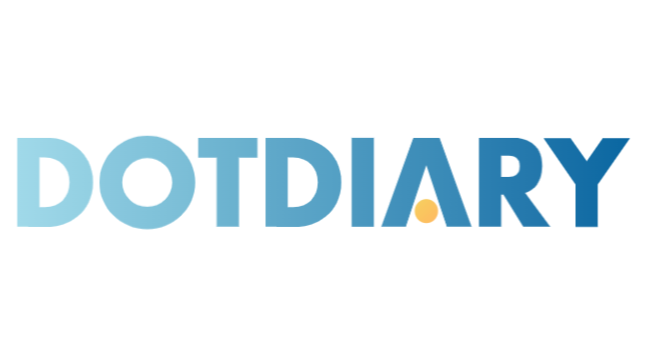

# DotDairy - Frontend

## Description
DotDiary is a website that allow users to create FocusLogs and track it over time. The FocusLog contains a focus tag such as (working, studying, reading, writing, etc.), session timer, to-do list, distractions list and after stop the FocusLog, a rate and notes are required to review the session. Also, a weekly report visualize the week progress, sessions by date to help the user get understandable data and learn their focus pattren to increase productivity and time management. Using Django Rest Framework (DRF) for the backend, with React for the frontend, and postgreSQL for the DB creates a valuable application with enhanced functionalities.

## Tech stack
* Django Rest Framework
* React
* PostgreSQL
* VS Code

## Backend-End Repo Link
https://github.com/iijumanaAhmed/DotDiary-Backend

## IceBox Features
1. Forgot Password
2. Admin Dashboard & Management Pages
3. FocusLogs Searching by Title